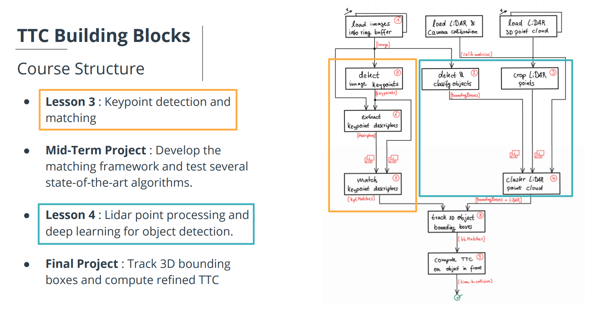

# SFND 3D Object Tracking

## Final Report for Track an Objeci in 3D Space

### FP.1 Match 3D Objects

```cpp
void matchBoundingBoxes(std::vector<cv::DMatch> &matches, std::map<int, int> &bbBestMatches, DataFrame &prevFrame, DataFrame &currFrame)
{

    for (const auto& prevBox : prevFrame.boundingBoxes)
    {
        int maxMatchCount = 0;
        int bestMatchBoxId = -1;

        for (const auto& currBox : currFrame.boundingBoxes)
        {
            int matchCount = 0;

            for (const auto& match : matches)
            {
                int prevKeyPointIdx = match.queryIdx;
                int currKeyPointIdx = match.trainIdx;

                if (prevBox.roi.contains(prevFrame.keypoints[prevKeyPointIdx].pt) &&
                    currBox.roi.contains(currFrame.keypoints[currKeyPointIdx].pt))
                {
                    matchCount++;
                }
            }

            if (matchCount > maxMatchCount)
            {
                maxMatchCount = matchCount;
                bestMatchBoxId = currBox.boxID;
            }
        }

        bbBestMatches[prevBox.boxID] = bestMatchBoxId;
    }

}
```

### FP.2 Compute Lidar-based TTC

```cpp
void computeTTCLidar(std::vector<LidarPoint> &lidarPointsPrev,
                     std::vector<LidarPoint> &lidarPointsCurr, double frameRate, double &TTC)
{
    
    double dT = 1.0 / frameRate;
    double laneWidth = 1.2;     // width of the preceding lidar area
    
    double yEdge = (laneWidth - 0.2) / 2;

    auto checkFunc = [&yEdge](const LidarPoint &lp) { return std::abs(lp.y) < yEdge; };

    // Filter out Lidar points outside the ego lane
    lidarPointsPrev.erase(std::remove_if(lidarPointsPrev.begin(), lidarPointsPrev.end(), checkFunc), lidarPointsPrev.end());
    lidarPointsCurr.erase(std::remove_if(lidarPointsCurr.begin(), lidarPointsCurr.end(), checkFunc), lidarPointsCurr.end());

    // Sort the Lidar points based on x-coordinate
    std::sort(lidarPointsPrev.begin(), lidarPointsPrev.end(), [](const LidarPoint &lp1, const LidarPoint &lp2) { return lp1.x < lp2.x; });
    std::sort(lidarPointsCurr.begin(), lidarPointsCurr.end(), [](const LidarPoint &lp1, const LidarPoint &lp2) { return lp1.x < lp2.x; });

    // Calculate the median x-coordinate for the Lidar points
    double prevXMedian = lidarPointsPrev[lidarPointsPrev.size() / 2].x;
    double currXMedian = lidarPointsCurr[lidarPointsCurr.size() / 2].x;
    
    TTC = currXMedian * dT / (prevXMedian - currXMedian);

}

```

### FP.3 Associate Keypoint Correspondences with Bounding Boxes

```cpp
void clusterKptMatchesWithROI(BoundingBox &boundingBox_c, BoundingBox &boundingBox_p, std::vector<cv::KeyPoint> &kptsPrev, std::vector<cv::KeyPoint> &kptsCurr, std::vector<cv::DMatch> &kptMatches)
{
    float shrinkFactor = 0.12;
    cv::Rect smallerBox_c(
        boundingBox_c.roi.x + shrinkFactor * boundingBox_c.roi.width / 2.0,
        boundingBox_c.roi.y + shrinkFactor * boundingBox_c.roi.height / 2.0,
        boundingBox_c.roi.width * (1 - shrinkFactor),
        boundingBox_c.roi.height * (1 - shrinkFactor)
    );

    cv::Rect smallerBox_p(
        boundingBox_p.roi.x + shrinkFactor * boundingBox_p.roi.width / 2.0,
        boundingBox_p.roi.y + shrinkFactor * boundingBox_p.roi.height / 2.0,
        boundingBox_p.roi.width * (1 - shrinkFactor),
        boundingBox_p.roi.height * (1 - shrinkFactor)
    );

    std::vector<cv::DMatch> kptMatches_roi;

    for (const auto& match : kptMatches)
    {
        cv::KeyPoint train = kptsCurr[match.trainIdx];
        cv::KeyPoint query = kptsPrev[match.queryIdx];

        auto train_pt = cv::Point(train.pt.x, train.pt.y);
        auto query_pt = cv::Point(query.pt.x, query.pt.y);

        if (smallerBox_c.contains(train_pt) && smallerBox_p.contains(query_pt))
            kptMatches_roi.push_back(match);
    }

    double dist_mean = 0.0;
    for (const auto& match : kptMatches_roi)
    {
        cv::KeyPoint train = kptsCurr[match.trainIdx];
        cv::KeyPoint query = kptsPrev[match.queryIdx];

        auto train_pt = cv::Point(train.pt.x, train.pt.y);
        auto query_pt = cv::Point(query.pt.x, query.pt.y);

        dist_mean += cv::norm(train_pt - query_pt);
    }

    dist_mean /= kptMatches_roi.size();

    for (const auto& match : kptMatches_roi)
    {
        cv::KeyPoint train = kptsCurr[match.trainIdx];
        cv::KeyPoint query = kptsPrev[match.queryIdx];

        auto train_pt = cv::Point(train.pt.x, train.pt.y);
        auto query_pt = cv::Point(query.pt.x, query.pt.y);

        if (cv::norm(train_pt - query_pt) < dist_mean * 1.5)
            boundingBox_c.kptMatches.push_back(match);
    }

    std::cout << "curr_bbx_matches_size: " << boundingBox_c.kptMatches.size() << std::endl;
}
```

### FP.4 Compute Camera-based TTC
```cpp
void computeTTCCamera(std::vector<cv::KeyPoint> &kptsPrev, std::vector<cv::KeyPoint> &kptsCurr, 
                      std::vector<cv::DMatch> kptMatches, double frameRate, double &TTC, cv::Mat *visImg)
{
    std::vector<double> distRatios;
    
    for (size_t i = 0; i < kptMatches.size() - 1; ++i)
    {
        const cv::KeyPoint& kpOuterCurr = kptsCurr[kptMatches[i].trainIdx];
        const cv::KeyPoint& kpOuterPrev = kptsPrev[kptMatches[i].queryIdx];

        for (size_t j = i + 1; j < kptMatches.size(); ++j)
        {
            const cv::KeyPoint& kpInnerCurr = kptsCurr[kptMatches[j].trainIdx];
            const cv::KeyPoint& kpInnerPrev = kptsPrev[kptMatches[j].queryIdx];

            double distCurr = cv::norm(kpOuterCurr.pt - kpInnerCurr.pt);
            double distPrev = cv::norm(kpOuterPrev.pt - kpInnerPrev.pt);

            if (distPrev > std::numeric_limits<double>::epsilon() && distCurr >= 100.0)
            {
                double distRatio = distCurr / distPrev;
                distRatios.push_back(distRatio);
            }
        }
    }

    if (distRatios.empty())
    {
        TTC = NAN;
        return;
    }

    std::sort(distRatios.begin(), distRatios.end());

    size_t medIndex = distRatios.size() / 2;
    double medDistRatio = (distRatios.size() % 2 == 0)
        ? (distRatios[medIndex - 1] + distRatios[medIndex]) / 2.0
        : distRatios[medIndex];

    double dT = 1.0 / frameRate;
    TTC = -dT / (1.0 - medDistRatio);


}
```

### FP.5 Performance Evaluation 1
The most important factor in the stable calculation of the TTC is the deletion of data other than required fields.  Filtering prevents unnecessary data from disturbing the stability of the calculation.

### FP.6 Performance Evaluation 2
In the table below you can see the absolute value of the **TTC** difference between camera and lidar and the total number of computable values by detector and descriptor. In the **Harris** detector, the number of scenes that can be calculated is quite low and the difference in calculation between camera and lidar is quite high. In **SHITOMASI**, on the other hand, the difference between camera and lidar is small. Combinations with the **AKAZE** detector also produced very good values.

**Summary**

| Detector   | SHITOMASI | SHITOMASI | SHITOMASI | SHITOMASI | HARRIS | HARRIS | HARRIS | HARRIS | FAST | FAST | FAST | FAST | BRISK | BRISK | BRISK | BRISK | AKAZE | AKAZE | AKAZE | AKAZE | AKAZE |
|------------|-----------|-----------|-----------|-----------|--------|--------|--------|--------|------|------|------|------|-------|-------|-------|-------|-------|-------|-------|-------|-------|
| Descriptor | BRISK     | BRIEF     | ORB       | FREAK     | BRISK  | BRIEF  | ORB    | FREAK  | BRISK| BRIEF| ORB  | FREAK| BRISK | BRIEF | ORB   | FREAK | BRISK | BRIEF | ORB   | FREAK | AKAZE |
| Average    | 2.19      | 5.22      | 4.03      | 2.50      | 29.80  | 14.25  | 16.03  | 17.72  | 1.86 | 4.87 | 7.42 | 4.30 | 3.87  | 5.53  | 3.72  | 4.39  | 3.22  | 2.82  | 2.45  | 2.42  | 1.82  |
| Number of Valid TTC | 17 | 18 | 18 | 17 | 9 | 9 | 8 | 8 | 16 | 18 | 18 | 18 | 18 | 18 | 18 | 18 | 18 | 18 | 18 | 18 | 18 |


##### NOTE: You can find all detailed results in the folder of `./dat/results`.

---
## SFND 3D Object Tracking
 
Welcome to the final project of the camera course. By completing all the lessons, you now have a solid understanding of keypoint detectors, descriptors, and methods to match them between successive images. Also, you know how to detect objects in an image using the YOLO deep-learning framework. And finally, you know how to associate regions in a camera image with Lidar points in 3D space. Let's take a look at our program schematic to see what we already have accomplished and what's still missing.



In this final project, you will implement the missing parts in the schematic. To do this, you will complete four major tasks: 
1. First, you will develop a way to match 3D objects over time by using keypoint correspondences. 
2. Second, you will compute the TTC based on Lidar measurements. 
3. You will then proceed to do the same using the camera, which requires to first associate keypoint matches to regions of interest and then to compute the TTC based on those matches. 
4. And lastly, you will conduct various tests with the framework. Your goal is to identify the most suitable detector/descriptor combination for TTC estimation and also to search for problems that can lead to faulty measurements by the camera or Lidar sensor. In the last course of this Nanodegree, you will learn about the Kalman filter, which is a great way to combine the two independent TTC measurements into an improved version which is much more reliable than a single sensor alone can be. But before we think about such things, let us focus on your final project in the camera course. 

## Dependencies for Running Locally
* cmake >= 2.8
  * All OSes: [click here for installation instructions](https://cmake.org/install/)
* make >= 4.1 (Linux, Mac), 3.81 (Windows)
  * Linux: make is installed by default on most Linux distros
  * Mac: [install Xcode command line tools to get make](https://developer.apple.com/xcode/features/)
  * Windows: [Click here for installation instructions](http://gnuwin32.sourceforge.net/packages/make.htm)
* Git LFS
  * Weight files are handled using [LFS](https://git-lfs.github.com/)
  * Install Git LFS before cloning this Repo.
* OpenCV >= 4.1
  * This must be compiled from source using the `-D OPENCV_ENABLE_NONFREE=ON` cmake flag for testing the SIFT and SURF detectors.
  * The OpenCV 4.1.0 source code can be found [here](https://github.com/opencv/opencv/tree/4.1.0)
* gcc/g++ >= 5.4
  * Linux: gcc / g++ is installed by default on most Linux distros
  * Mac: same deal as make - [install Xcode command line tools](https://developer.apple.com/xcode/features/)
  * Windows: recommend using [MinGW](http://www.mingw.org/)

## Basic Build Instructions

1. Clone this repo.
2. Make a build directory in the top level project directory: `mkdir build && cd build`
3. Compile: `cmake .. && make`
4. Run it: `./3D_object_tracking`.
